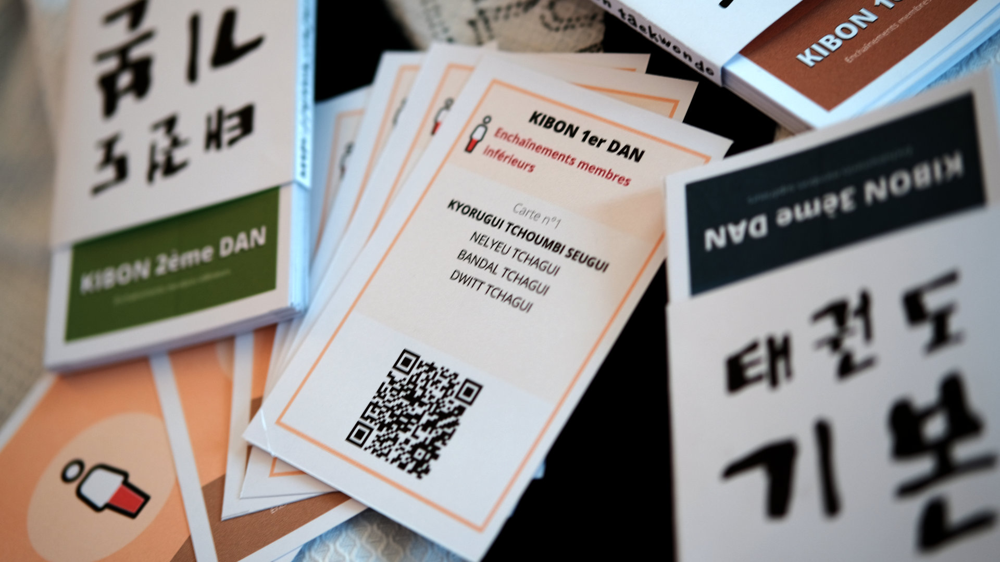

# Kibon

## 🥋 Les fiches de révision des Kibons de Taekwondo avec QR-code vers les vidéos

Ce projet génère des cartes pédagogiques de Taekwondo à imprimer, à découper et à utiliser pour réviser les **Kibons**.  
Ces cartes sont similaires à celles utilisées lors des examens Dan de la [FFTDA](https://fftda.fr/), avec une particularité :  
> 📱 Chaque carte contient un **QR-code** qui renvoie directement vers la **vidéo d’exemple officielle** de la FFTDA.

📄 **Source :**  
[KIBON_2022.pdf](https://www.fftda.fr/files/file/DS_DANS/GRADE_2022/KIBON_2022.pdf)


---

## ✂️ Comment confectionner les cartes de révision Kibon

📥 Télécharger le fichier PDF final :  
[kibon.pdf](https://github.com/moudok/kibon/raw/main/kibon.pdf)

🖨️ Imprimer sur du **papier épais** au format :

- 📄 **A4**
- ⬅️ **Paysage**
- 🔄 **Recto / verso** (mode paysage ou bord court)
- 📏 Aucune mise à l’échelle (**100%**)

✂️ **Découper** ensuite les 8 cartes par page en suivant les guides de coupe.

---

Pour l'étui :  
[boite.pdf](https://github.com/moudok/kibon/raw/main/boite.pdf)

🖨️ Imprimer sur du **papier épais** au format :

- 📄 **A4**
- ⬇️ **Portrait**
- 📏 Aucune mise à l’échelle (**100%**)

✂️ **Découper** en suivant les guides de coupe et coller les parties grises.

---

## ⚙️ Pour générer le PDF soi-même

### 📁 Structure du projet

- [`kibon.yaml`](kibon.yaml) : Contenu des Kibons (catégories, mouvements, vidéos)
- [`config.yaml`](config.yaml) : Paramétrage graphique (couleurs, pictogrammes SVG)
- [`make_pdf_cards.py`](make_pdf_cards.py) : Script principal de génération

### 🐍 Prérequis

- Un interpréteur [Python 3](https://www.python.org/downloads/) installé sur votre machine

### 🚀 Étapes

```bash
# Cloner ce dépôt
git clone https://github.com/moudok/kibon.git
cd kibon

# Créer un environnement virtuel
python -m venv env
source env/bin/activate

# Installer les dépendances
pip install -r requirements.txt

# Lancer le script
python3 make_pdf_cards.py
```

Le fichier `kibon.pdf` sera généré dans le répertoire courant.

---

## 📬 Contact

💡 Une idée d’amélioration ? Une erreur à signaler ?  
👉 Écrivez-moi à : **benjamin@moudok.fr**

---

## 🇰🇷 수고하셨습니다 ! 👏
